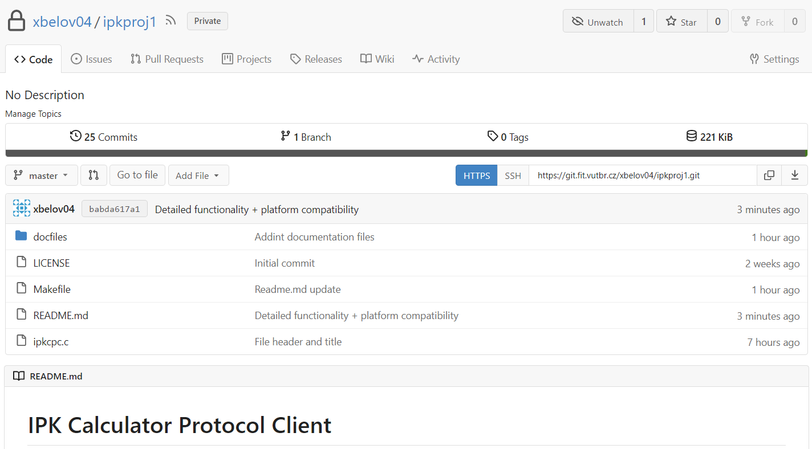
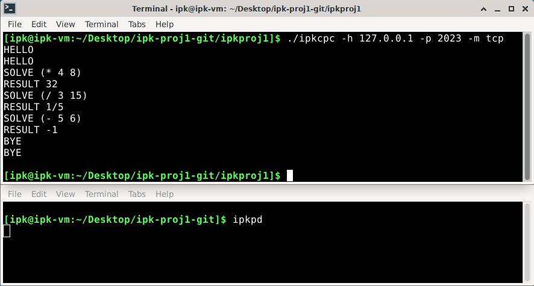
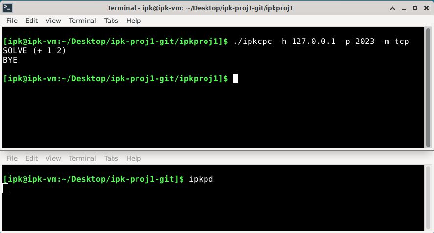
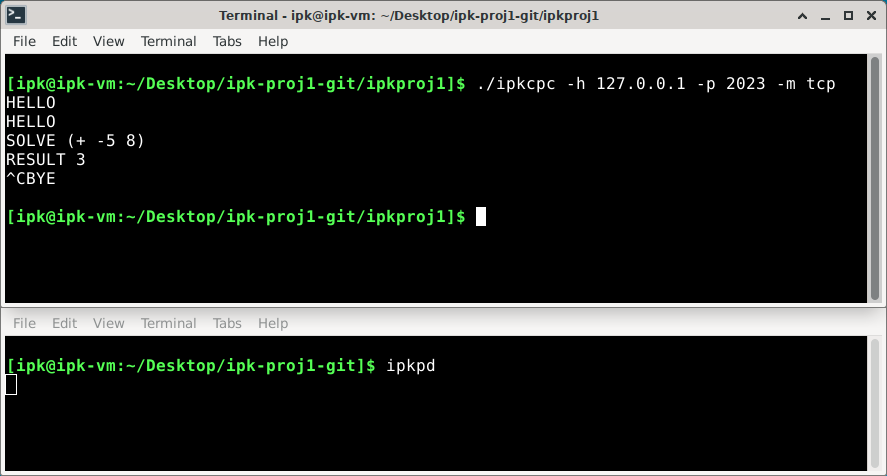
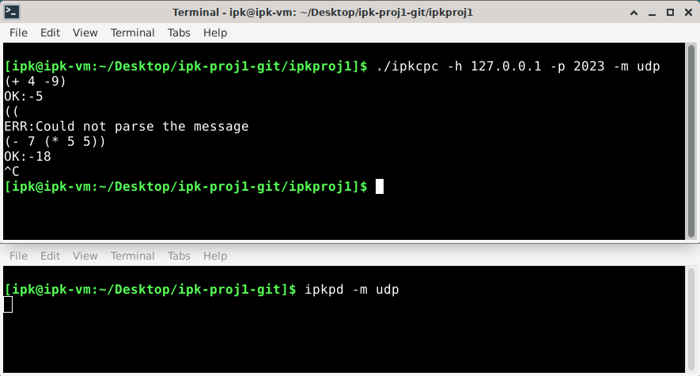
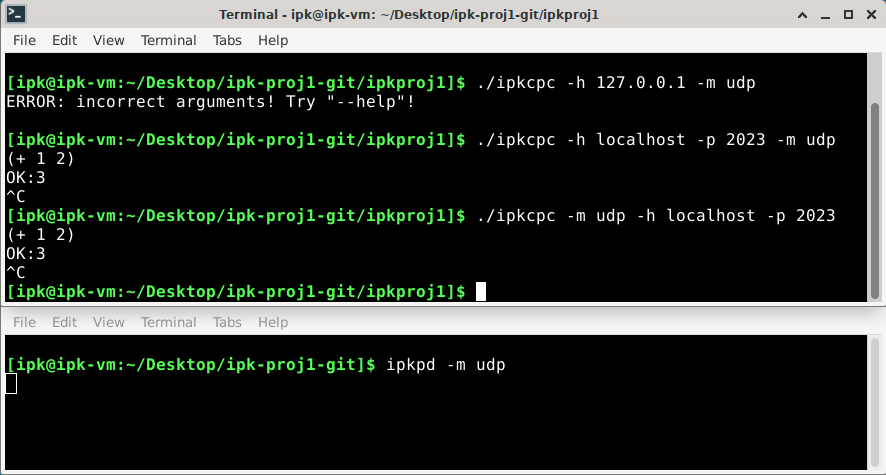

# IPK Calculator Protocol Client

The program is used for client/server communication and represents the client side of the communication , it uses the IPK Calculator Protocol [1] for communication with the server.

  

## Usage

  

To build the program, run the ***make*** command in your **Unix** command line while inside the main directory.

  

The usage is:

>  *./ipkcpc -h \<host\> -p \<port\> -m \<mode\>*

  

The arguments may follow in any order but all arguments must be filled out, otherwise the program responds with an error message.

  

The host is the IP of the desired server to communicate with and the port should be the one that the server is listening on and accepting requests.

  

There are only two selectable modes for the program:

  

- tcp (textual)

- udp (binary)

  

Every different mode argument will be followed with an error message.

## Detailed description

The program reads through the arguments and checks, if all have been filled out. Determines what is the host IP and port, and what mode will be used.

Uses **getaddrinfo()** to get the needed information about the server so it can establish a connection. Based on the selected mode, the program either creates a **SOCK_STREAM** (TCP) socket or a **SOCK_DGRAM** (UDP) socket.

### TCP

For TCP the program calls the **connect()** function with the created socket and information about the server as arguments. If the connecting succeeded, the program enters a loop, in which at first it waits for the user input by calling **fgets()**, this function reads the input and copies it into a **buffer** specified by the arguments passed to it. It sends the information from the buffer to the server using the **send()** function and then waits for the response from the server by calling the **recv()** function, which it prints to the **stdout**.

The connection is terminated when the user sends the *"BYE"* message or an incorrectly formatted message, the server responds to both by sending a *"BYE"* message, and terminating its side of the connection. 

The connection can be also terminated by pressing the **Ctrl-C** combination, to which the program reacts by sending the *"BYE"* message to the server.

Finally the program closes the socket and ends its run.

### UDP

For UDP, there's no **connect()** call needed. The program enters the loop in which it reads the user input from **stdin** using the **fgets()** function. There are two buffers needed to ensure the correct and simple sending of information. After it has loaded the message into the second buffer, the program sets the **0th** index of the main buffer to the value **0**. Zero is the **opcode** for request, it means the server will know we are sending a expression for it to solve. Then it sets the **1st** index of the main buffer to the length of the message inside the second buffer. Finally, it copies the message from the second to the main buffer and sends the message with the **sendto()** function.

After the message has been sent, it calls the **recvfrom()** function, so it can receive the answer for our request. After the answer has arrived, the program checks the **1st** index of the buffer into which it received the answer. If the value is **0**, it means the message sent was in the correct format, and the server sent the result, so the program prints out **"OK:"** and the **result**. However if the value is set to **1**, it means the message was incorrect, and inside the buffer there's the error message sent by the server, so it prints **"ERR:"** and the **error message**.

The transmission is terminated by pressing the **Ctrl-C** combination. At last the program closes the socket and ends its run.

## Multiplatform compatibility

The compatibility between **Unix** and **Windows** systems is secured by using **#ifdef** macros, where the program decides which libraries to include for which platform.

## Gitea snapshot

The snapshot of the used Gitea repository:

## Testing

### TCP tests

  

Basic functionality test:

  

  

Omitting "HELLO" message test:

  

  

Terminating connection with Ctrl-C test:

  

  

### UDP tests

  

Basic functionality test:

  

  

### Other tests

  

Argument behavior test:

  

  
 ## Extra functionality
 
  The following are implemented:
  - option "\-\-help" which prints out the correct usage
  - arguments can be in any order

## References

[1] https://git.fit.vutbr.cz/NESFIT/IPK-Projekty/src/branch/master/Project%201/Protocol.md